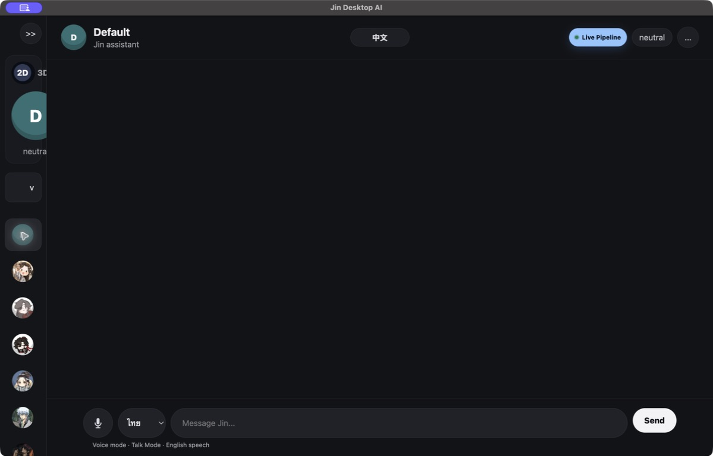
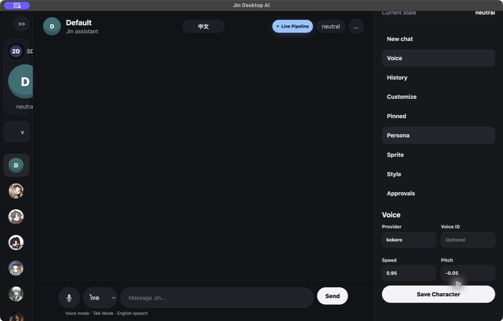

# Jin

### A little company for your desktop.

Jin is a local-first AI desktop companion for Mac. It brings character conversations, floating desktop companions, voice, and Chinese subtitle assistance into one personal workspace.

**Mac · Local AI · Character chat · Desktop companions · In development**

*The installed Jin app, shown with an empty default conversation. Screenshots show version 1.0.29.*

## What can Jin do?

| Feature | What it brings to your desktop |
| --- | --- |
| **Character chat** | Choose a character, customize its persona and conversation style, and return to a separate conversation history for each character. |
| **Floating companions** | Pull a supported character out of its profile and onto the desktop. Companions can walk along the screen edge, be repositioned, and show a floating chat bubble. |
| **Voice** | Speak through the microphone and hear spoken replies when the required speech components are available. Character settings include voice provider, speed, and pitch. |
| **Chinese subtitle assistance** | Select a subtitle region on your screen. Jin reads the text using local OCR and offers dictionary-based English assistance in an overlay. |

## Made to live on your Mac

Jin uses models installed locally through Ollama for AI conversations. Its desktop app starts a local backend and keeps conversation and character memory on the computer. Jin is the application around the model; it is not a new AI model of its own.

You choose a character and local model, then type or use voice. Supported characters can accompany you outside the main window. The **中文** control opens Chinese learning mode, where you choose what screen region Jin can read.

Local-first describes the core design. Optional integrations and the speech system can have their own requirements; this is not a promise that every feature works offline in every setup.

## A closer look at voice

*Voice controls in the installed app. No personal conversation content is shown.*

## Current boundaries

Jin is an evolving prototype. The current packaged desktop target is **macOS on Apple silicon**.

- Desktop companions require a compatible sprite configuration; not every character has one.
- Voice depends on the available speech components and microphone permissions.
- Chinese subtitle assistance depends on screen-capture permission, readable text, and dictionary coverage. It is not full, context-aware video translation.
- The optional Blender bridge is experimental. A complete live 3D avatar experience is not presented as a finished feature.
- AI response quality and speed depend on the selected local model and computer.

## Can I run Jin here?

**This repository is a showcase only. Jin does not run inside GitHub.**

There is no app installer, runnable demo, or application source code in this repository. Downloading or cloning it gives you this introduction and its images, not the Jin app. Using Jin's desktop features requires a separately installed Mac application and its local dependencies.

[GitHub Pages hosts static websites](https://docs.github.com/en/pages/getting-started-with-github-pages/what-is-github-pages); it cannot run Jin's Mac desktop windows, local Python backend, or Ollama models as a hosted app.

## About this showcase

Only this introduction and selected screenshots are published here. Jin's application source, private conversations, character memory, and local configuration are not included.

Character names and artwork visible in the interface belong to their respective owners. Their appearance in this showcase does not imply affiliation or endorsement.
